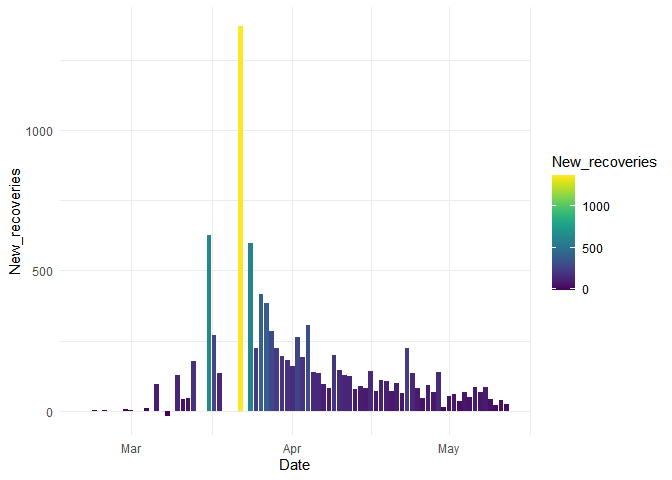
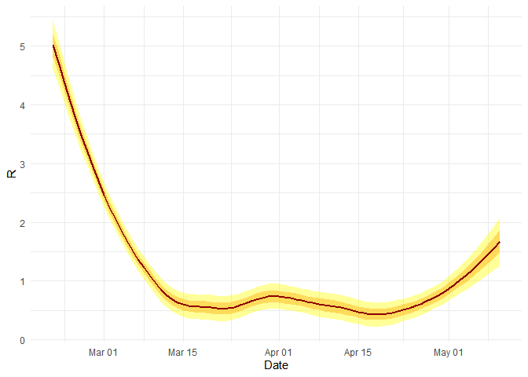
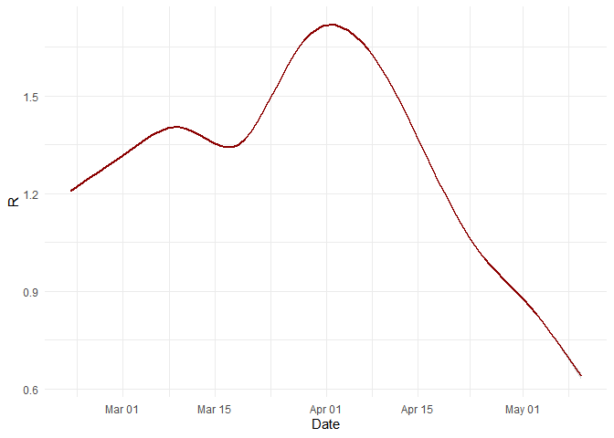

Ugne Klimaviciute and Neringa Kieliute

# **Final Project: Analysis of the Covid-19 impact on economic activity**

This was a group project I had to do for university.

### 1\. Our country of choice to analyze was South Korea.

``` r
library(tidyverse)
library(tidyr)
library(dplyr)
library(readr)
library(ggplot2)
library(lubridate)
library(stringr)
library(parsedate)
library(viridis)
library(stargazer)
library(knitr)
library(sjPlot)
library(rmarkdown)

mobility <- read_csv("https://github.com/vzemlys/cda_course/raw/master/data/final_project/Global_Mobility_Report.csv") %>% 
  filter(country_region == "South Korea") %>% 
  rename("Date" = date,
         "Country/Region" = country_region)

database <- read_csv("https://github.com/vzemlys/cda_course/raw/master/data/final_project/database_20200513_061217.csv") %>% 
  filter(`Country/Region` == "South Korea")

ts_conf <- read_csv("https://github.com/vzemlys/cda_course/raw/master/data/final_project/time_series_covid19_confirmed_global.csv")%>%
  filter(`Country/Region` == "Korea, South") %>% 
  select(-c("Province/State", "Lat", "Long")) %>%
  pivot_longer(-`Country/Region`,
               names_to = "Date",
               values_to = "Cases"
  )


ts_deaths <- read_csv("https://github.com/vzemlys/cda_course/raw/master/data/final_project/time_series_covid19_deaths_global.csv") %>% 
  filter(`Country/Region` == "Korea, South") %>% 
  select(-c("Province/State", "Lat", "Long")) %>% 
  pivot_longer(-`Country/Region`,
               names_to = "Date",
               values_to = "Deaths"
  )

ts_recovered <- read_csv("https://github.com/vzemlys/cda_course/raw/master/data/final_project/time_series_covid19_recovered_global.csv") %>% 
  filter(`Country/Region`  == "Korea, South") %>% 
  select(-c("Province/State", "Lat", "Long")) %>% 
  pivot_longer(-`Country/Region`,
               names_to = "Date",
               values_to = "Recovered"
  )

ts <- full_join(ts_conf, ts_deaths)

ts <- full_join(ts, ts_recovered) %>% 
  mutate(
    Date = ymd(parse_date(ts$Date))
  )

ts$`Country/Region` <- recode(ts$`Country/Region`,
                              "Korea, South" = "South Korea"
)
```

### 2\. We combined all of the data in one data frame for South Korea only.

Rows contain the days and columns have such variables as number of
deaths, death rate, confirmed cases, recovered cases, effective
reproduction rate, mobility changes from the baseline in various
environments and etc.

``` r
Data <- full_join(ts, mobility) %>% 
  full_join(database) %>% 
  select(-c("country_region_code", "sub_region_1", "sub_region_2", "last_updated")) %>% 
  mutate(
    New_cases = c(NA, diff(Cases)),
    New_deaths = c(NA, diff(Deaths)),
    New_recoveries = c(NA, diff(Recovered)),
    Active = Cases - (Deaths+Recovered),
    Death_rate = Deaths/Cases
  ) %>% 
  filter(Date > "2020-02-20") %>% 
  rename(
    Retail_Recr = retail_and_recreation_percent_change_from_baseline,
    Grocery_Pharm = grocery_and_pharmacy_percent_change_from_baseline,
    Parks = parks_percent_change_from_baseline,
    Transit = transit_stations_percent_change_from_baseline,
    Workplaces = workplaces_percent_change_from_baseline,
    Residential = residential_percent_change_from_baseline
  )

theme_set(theme_minimal())
```

### 3\. We did exploratory analysis of the data on different levels:

### Case growth over time.

Cases grew in an upward trend, with a particulary steep slope around the
beggining of March.

``` r
Data %>% 
  ggplot()+
  geom_line(aes(Date, Cases, color = Cases))
```

<!-- -->

### New cases through time.

The highest amount of new cases appeared during the end of February and
beginning of March.

``` r
Data %>% 
  ggplot()+
  geom_col(aes(Date, New_cases, fill = New_cases))+
  scale_fill_viridis()
```

<!-- -->

### The largest jump in new cases in a day.

``` r
maxcases <- Data[which.max(Data$New_cases),] %>% 
  select(Date, New_cases)

kable(maxcases,
      col.names = c("Date", "New cases"))
```

| Date       | New cases |
| :--------- | --------: |
| 2020-03-03 |       851 |

### Daily deaths.

``` r
Data %>% 
  ggplot()+
  geom_col(aes(Date, New_deaths, fill = New_deaths))+
  scale_fill_viridis()
```

<!-- -->

### The largest jump in new deaths in a day.

``` r
maxdeaths <- Data[which.max(Data$New_deaths),] %>% 
  select(Date, New_deaths)

kable(maxdeaths,
      col.names = c("Date", "New deaths"))
```

| Date       | New deaths |
| :--------- | ---------: |
| 2020-03-02 |         11 |

### Recoveries.

``` r
Data %>% 
  ggplot()+
  geom_col(aes(Date, New_recoveries, fill = New_recoveries))+
  scale_fill_viridis()
```

<!-- -->

### Largest jump in recoveries:

``` r
maxrecoveries <- Data[which.max(Data$New_recoveries),] %>% 
  select(Date, New_recoveries)

kable(maxrecoveries,
      col.names = c("Date", "New recoveries"))
```

| Date       | New recoveries |
| :--------- | -------------: |
| 2020-03-22 |           1369 |

### Active vs Recovered cases.

``` r
Data %>%
  ggplot()+
  coord_cartesian()+
  geom_line(aes(Date, Recovered), color = "green")+
  geom_line(aes(Date, Active), color = "red")
```

<!-- -->

### R by day (the average number of people infected by a single infectious individual by day).

``` r
Data %>% 
  filter(days_infectious == 7) %>% 
  ggplot()+
  geom_smooth(aes(Date, R), fill = "yellow")+
  geom_smooth(aes(Date, R), color = "darkred", level = 0.65, fill = "orange")
```

<!-- -->

### R and days infectious.

Our dataset contains different R squared values depending on how long we
expect an average person to be able to transmit the virus. In reality,
days infectious may be even longer than that - according to Simas
Kucinskas’ research paper, the actual number may be closer to 23 days.

``` r
Data %>%
  mutate(days_infectious = as.factor(days_infectious)) %>% 
  ggplot()+
  geom_smooth(aes(Date, R, color = days_infectious))
```

<!-- -->

### Movement changes over time.

We can see a prominent increase in mobility in Parks, which corresponds
with our expectations of people being more likely to spend time in
nature during times of social distancing.

Residential mobility is also somewhat higher than the baseline, which
makes sense, given that more people should have started staying at home.

Grocery and Pharmacy experienced a drop initially, but later on started
exceeding the baseline mobility percentages, possibly because South
Korea was fairly effective at handling the covid crisis right from the
beginning, meaning that restrictions could be raised earlier than in
other countries.

``` r
Data %>%
  gather(key = Type, value = Percent_change,
         c("Retail_Recr", "Grocery_Pharm", "Parks", "Transit", "Workplaces", "Residential")) %>% 
  select(Date, Type, Percent_change) %>% 
  ggplot()+
  geom_smooth(aes(Date, Percent_change, group = Type, color = Type))+
  labs(title = "Movement changes",
       y = "Percent change from baseline")
```

<!-- -->

### Death rate over time.

The change in death rate is an interesting variable to look at. It could
reflect changes in the healthcare system’s ability to care for the
critically ill, or changes in testing.

``` r
Data %>%
  ggplot(aes(Date, Death_rate, color = Death_rate))+
  geom_line()
```

<!-- -->

### Simple models which explain separate mobility indicator changes with Covid-19 cases data.

``` r
test <- Data %>% filter(Date >= "2020-05-05")
train <- Data %>% filter(Date < "2020-05-05")

mod_1 <- lm(Retail_Recr ~ Cases + Deaths , data = train)

mod_2 <- lm(Grocery_Pharm ~ Cases + Deaths , data = train)

mod_3 <- lm(Parks ~ Cases + Deaths , data = train)

mod_4 <- lm(Transit ~ Cases + Deaths , data = train)

mod_5 <- lm(Workplaces ~ Cases + Deaths , data = train)

mod_6 <- lm(Residential ~ Cases + Deaths , data = train)

tab_model(mod_1, mod_2, mod_3, mod_4, mod_5, mod_6, p.style = "stars", show.ci = FALSE)
```

<table style="border-collapse:collapse; border:none;">

<tr>

<th style="border-top: double; text-align:center; font-style:normal; font-weight:bold; padding:0.2cm;  text-align:left; ">

 

</th>

<th colspan="1" style="border-top: double; text-align:center; font-style:normal; font-weight:bold; padding:0.2cm; ">

Retail\_Recr

</th>

<th colspan="1" style="border-top: double; text-align:center; font-style:normal; font-weight:bold; padding:0.2cm; ">

Grocery\_Pharm

</th>

<th colspan="1" style="border-top: double; text-align:center; font-style:normal; font-weight:bold; padding:0.2cm; ">

Parks

</th>

<th colspan="1" style="border-top: double; text-align:center; font-style:normal; font-weight:bold; padding:0.2cm; ">

Transit

</th>

<th colspan="1" style="border-top: double; text-align:center; font-style:normal; font-weight:bold; padding:0.2cm; ">

Workplaces

</th>

<th colspan="1" style="border-top: double; text-align:center; font-style:normal; font-weight:bold; padding:0.2cm; ">

Residential

</th>

</tr>

<tr>

<td style=" text-align:center; border-bottom:1px solid; font-style:italic; font-weight:normal;  text-align:left; ">

Predictors

</td>

<td style=" text-align:center; border-bottom:1px solid; font-style:italic; font-weight:normal;  ">

Estimates

</td>

<td style=" text-align:center; border-bottom:1px solid; font-style:italic; font-weight:normal;  ">

Estimates

</td>

<td style=" text-align:center; border-bottom:1px solid; font-style:italic; font-weight:normal;  ">

Estimates

</td>

<td style=" text-align:center; border-bottom:1px solid; font-style:italic; font-weight:normal;  ">

Estimates

</td>

<td style=" text-align:center; border-bottom:1px solid; font-style:italic; font-weight:normal;  ">

Estimates

</td>

<td style=" text-align:center; border-bottom:1px solid; font-style:italic; font-weight:normal;  col7">

Estimates

</td>

</tr>

<tr>

<td style=" padding:0.2cm; text-align:left; vertical-align:top; text-align:left; ">

(Intercept)

</td>

<td style=" padding:0.2cm; text-align:left; vertical-align:top; text-align:center;  ">

\-28.78 <sup>\*\*\*</sup>

</td>

<td style=" padding:0.2cm; text-align:left; vertical-align:top; text-align:center;  ">

\-8.47 <sup>\*\*\*</sup>

</td>

<td style=" padding:0.2cm; text-align:left; vertical-align:top; text-align:center;  ">

\-19.50 <sup>\*\*\*</sup>

</td>

<td style=" padding:0.2cm; text-align:left; vertical-align:top; text-align:center;  ">

\-23.14 <sup>\*\*\*</sup>

</td>

<td style=" padding:0.2cm; text-align:left; vertical-align:top; text-align:center;  ">

\-9.20 <sup>\*\*\*</sup>

</td>

<td style=" padding:0.2cm; text-align:left; vertical-align:top; text-align:center;  col7">

9.15 <sup>\*\*\*</sup>

</td>

</tr>

<tr>

<td style=" padding:0.2cm; text-align:left; vertical-align:top; text-align:left; ">

Cases

</td>

<td style=" padding:0.2cm; text-align:left; vertical-align:top; text-align:center;  ">

\-0.00 <sup></sup>

</td>

<td style=" padding:0.2cm; text-align:left; vertical-align:top; text-align:center;  ">

\-0.00 <sup></sup>

</td>

<td style=" padding:0.2cm; text-align:left; vertical-align:top; text-align:center;  ">

0.00 <sup>\*\*</sup>

</td>

<td style=" padding:0.2cm; text-align:left; vertical-align:top; text-align:center;  ">

\-0.00 <sup>\*\*</sup>

</td>

<td style=" padding:0.2cm; text-align:left; vertical-align:top; text-align:center;  ">

0.00 <sup></sup>

</td>

<td style=" padding:0.2cm; text-align:left; vertical-align:top; text-align:center;  col7">

0.00 <sup></sup>

</td>

</tr>

<tr>

<td style=" padding:0.2cm; text-align:left; vertical-align:top; text-align:left; ">

Deaths

</td>

<td style=" padding:0.2cm; text-align:left; vertical-align:top; text-align:center;  ">

0.10 <sup>\*\*\*</sup>

</td>

<td style=" padding:0.2cm; text-align:left; vertical-align:top; text-align:center;  ">

0.09 <sup>\*\*\*</sup>

</td>

<td style=" padding:0.2cm; text-align:left; vertical-align:top; text-align:center;  ">

0.15 <sup>\*\*\*</sup>

</td>

<td style=" padding:0.2cm; text-align:left; vertical-align:top; text-align:center;  ">

0.08 <sup>\*\*\*</sup>

</td>

<td style=" padding:0.2cm; text-align:left; vertical-align:top; text-align:center;  ">

\-0.03 <sup>\*</sup>

</td>

<td style=" padding:0.2cm; text-align:left; vertical-align:top; text-align:center;  col7">

\-0.02 <sup>\*\*\*</sup>

</td>

</tr>

<tr>

<td style=" padding:0.2cm; text-align:left; vertical-align:top; text-align:left; padding-top:0.1cm; padding-bottom:0.1cm; border-top:1px solid;">

Observations

</td>

<td style=" padding:0.2cm; text-align:left; vertical-align:top; padding-top:0.1cm; padding-bottom:0.1cm; text-align:left; border-top:1px solid;" colspan="1">

444

</td>

<td style=" padding:0.2cm; text-align:left; vertical-align:top; padding-top:0.1cm; padding-bottom:0.1cm; text-align:left; border-top:1px solid;" colspan="1">

444

</td>

<td style=" padding:0.2cm; text-align:left; vertical-align:top; padding-top:0.1cm; padding-bottom:0.1cm; text-align:left; border-top:1px solid;" colspan="1">

444

</td>

<td style=" padding:0.2cm; text-align:left; vertical-align:top; padding-top:0.1cm; padding-bottom:0.1cm; text-align:left; border-top:1px solid;" colspan="1">

444

</td>

<td style=" padding:0.2cm; text-align:left; vertical-align:top; padding-top:0.1cm; padding-bottom:0.1cm; text-align:left; border-top:1px solid;" colspan="1">

444

</td>

<td style=" padding:0.2cm; text-align:left; vertical-align:top; padding-top:0.1cm; padding-bottom:0.1cm; text-align:left; border-top:1px solid;" colspan="1">

444

</td>

</tr>

<tr>

<td style=" padding:0.2cm; text-align:left; vertical-align:top; text-align:left; padding-top:0.1cm; padding-bottom:0.1cm;">

R<sup>2</sup> / R<sup>2</sup> adjusted

</td>

<td style=" padding:0.2cm; text-align:left; vertical-align:top; padding-top:0.1cm; padding-bottom:0.1cm; text-align:left;" colspan="1">

0.596 / 0.594

</td>

<td style=" padding:0.2cm; text-align:left; vertical-align:top; padding-top:0.1cm; padding-bottom:0.1cm; text-align:left;" colspan="1">

0.449 / 0.447

</td>

<td style=" padding:0.2cm; text-align:left; vertical-align:top; padding-top:0.1cm; padding-bottom:0.1cm; text-align:left;" colspan="1">

0.348 / 0.345

</td>

<td style=" padding:0.2cm; text-align:left; vertical-align:top; padding-top:0.1cm; padding-bottom:0.1cm; text-align:left;" colspan="1">

0.574 / 0.572

</td>

<td style=" padding:0.2cm; text-align:left; vertical-align:top; padding-top:0.1cm; padding-bottom:0.1cm; text-align:left;" colspan="1">

0.018 / 0.013

</td>

<td style=" padding:0.2cm; text-align:left; vertical-align:top; padding-top:0.1cm; padding-bottom:0.1cm; text-align:left;" colspan="1">

0.264 / 0.261

</td>

</tr>

<tr>

<td colspan="7" style="font-style:italic; border-top:double black; text-align:right;">

  - p\<0.05   \*\* p\<0.01   \*\*\* p\<0.001
    </td>
    </tr>

</table>

The Covid-19 data explain different mobility indicators differently. Not
for all of the indicators the Cases variable is significant (note the
lack of stars). They have different R-squared values, meaning that
Retail\_Recr and Transit both have the highest (around 0.6) which
indicates that their fit is quite ok. But, for example, Workplaces have
an incredibly low R-squared (0.02) which means that the fit is not
accurate.

### 6\. We used the models for forecasting. The forecasts were …

``` r
pred <- lapply(list(mod_1,mod_2, mod_3, mod_4, mod_5, mod_6), predict, newdata = test) %>% bind_cols()
colnames(pred) <- c("Retail_Recr_pr", "Grocery_Pharm_pr", "Parks_pr", "Transit_pr", "Workplaces_pr", "Residential_pr")

test2 <- test %>% select(Retail_Recr, Grocery_Pharm, Parks, Transit, Workplaces, Residential)

res <- bind_cols(test2, pred)
kable(head(res[, order(names(res))], 15))
```

| Grocery\_Pharm | Grocery\_Pharm\_pr | Parks | Parks\_pr | Residential | Residential\_pr | Retail\_Recr | Retail\_Recr\_pr | Transit | Transit\_pr | Workplaces | Workplaces\_pr |
| -------------: | -----------------: | ----: | --------: | ----------: | --------------: | -----------: | ---------------: | ------: | ----------: | ---------: | -------------: |
|             23 |           9.811291 |   114 |  48.95736 |          14 |        5.129596 |           13 |       \-7.779660 |    \-14 |  \-7.770808 |       \-56 |     \-10.78662 |
|             23 |           9.811291 |   114 |  48.95736 |          14 |        5.129596 |           13 |       \-7.779660 |    \-14 |  \-7.770808 |       \-56 |     \-10.78662 |
|             23 |           9.811291 |   114 |  48.95736 |          14 |        5.129596 |           13 |       \-7.779660 |    \-14 |  \-7.770808 |       \-56 |     \-10.78662 |
|             23 |           9.811291 |   114 |  48.95736 |          14 |        5.129596 |           13 |       \-7.779660 |    \-14 |  \-7.770808 |       \-56 |     \-10.78662 |
|             23 |           9.811291 |   114 |  48.95736 |          14 |        5.129596 |           13 |       \-7.779660 |    \-14 |  \-7.770808 |       \-56 |     \-10.78662 |
|             23 |           9.811291 |   114 |  48.95736 |          14 |        5.129596 |           13 |       \-7.779660 |    \-14 |  \-7.770808 |       \-56 |     \-10.78662 |
|              9 |           9.895114 |    48 |  49.11842 |           3 |        5.109794 |         \-10 |       \-7.682633 |     \-4 |  \-7.690474 |        \-1 |     \-10.81089 |
|              9 |           9.895114 |    48 |  49.11842 |           3 |        5.109794 |         \-10 |       \-7.682633 |     \-4 |  \-7.690474 |        \-1 |     \-10.81089 |
|              9 |           9.895114 |    48 |  49.11842 |           3 |        5.109794 |         \-10 |       \-7.682633 |     \-4 |  \-7.690474 |        \-1 |     \-10.81089 |
|              9 |           9.895114 |    48 |  49.11842 |           3 |        5.109794 |         \-10 |       \-7.682633 |     \-4 |  \-7.690474 |        \-1 |     \-10.81089 |
|              9 |           9.895114 |    48 |  49.11842 |           3 |        5.109794 |         \-10 |       \-7.682633 |     \-4 |  \-7.690474 |        \-1 |     \-10.81089 |
|              9 |           9.895114 |    48 |  49.11842 |           3 |        5.109794 |         \-10 |       \-7.682633 |     \-4 |  \-7.690474 |        \-1 |     \-10.81089 |
|              7 |           9.891318 |    36 |  49.15201 |           2 |        5.111053 |          \-7 |       \-7.687218 |     \-4 |  \-7.696744 |        \-1 |     \-10.80524 |
|              7 |           9.891318 |    36 |  49.15201 |           2 |        5.111053 |          \-7 |       \-7.687218 |     \-4 |  \-7.696744 |        \-1 |     \-10.80524 |
|              7 |           9.891318 |    36 |  49.15201 |           2 |        5.111053 |          \-7 |       \-7.687218 |     \-4 |  \-7.696744 |        \-1 |     \-10.80524 |

The forecasts do not appear to be extremely accurate for South Korea. We
mainly predicted lower amounts for the first half except for workplaces
which seems that we overpredicted.If we look at the second half, our
predictions are a bit more similar, except for workspaces - it’s still a
big difference.

The reason for such mispredictions might be that South Korea moved onto
an ‘everyday life quarantine’ scheme at the start of May and we didn’t
take into account effects that it might have.

### 7\. For comparisons we picked a second country that was quite culturally and geographically similar - Japan.

``` r
mobility_Japan <- read_csv("https://github.com/vzemlys/cda_course/raw/master/data/final_project/Global_Mobility_Report.csv") %>% 
  filter(country_region == "Japan") %>% 
  rename("Date" = date,
         "Country/Region" = country_region)

database_Japan <- read_csv("https://github.com/vzemlys/cda_course/raw/master/data/final_project/database_20200513_061217.csv") %>% 
  filter(`Country/Region` == "Japan")

ts_conf_Japan <- read_csv("https://github.com/vzemlys/cda_course/raw/master/data/final_project/time_series_covid19_confirmed_global.csv")%>%
  filter(`Country/Region` == "Japan") %>% 
  select(-c("Province/State", "Lat", "Long")) %>%
  pivot_longer(-`Country/Region`,
               names_to = "Date",
               values_to = "Cases"
  )

ts_deaths_Japan <- read_csv("https://github.com/vzemlys/cda_course/raw/master/data/final_project/time_series_covid19_deaths_global.csv") %>% 
  filter(`Country/Region` == "Japan") %>% 
  select(-c("Province/State", "Lat", "Long")) %>% 
  pivot_longer(-`Country/Region`,
               names_to = "Date",
               values_to = "Deaths"
  )

ts_recovered_Japan <- read_csv("https://github.com/vzemlys/cda_course/raw/master/data/final_project/time_series_covid19_recovered_global.csv") %>% 
  filter(`Country/Region`  == "Japan") %>% 
  select(-c("Province/State", "Lat", "Long")) %>% 
  pivot_longer(-`Country/Region`,
               names_to = "Date",
               values_to = "Recovered"
  )

ts_Japan <- full_join(ts_conf_Japan, ts_deaths_Japan)

ts_Japan <- full_join(ts_Japan, ts_recovered_Japan) %>% 
  mutate(
    Date = ymd(parse_date(ts_Japan$Date))
  )

ts_Japan$`Country/Region` <- recode(ts_Japan$`Country/Region`,
                                    "Japan" = "Japan"
)
```

### We combined all of the data in one data frame for Japan only. Rows contain the days and columns have such variables as number of deaths, death rate, confirmed cases, recovered cases, effective reproduction rate, mobility changes from the baseline in various environments and etc.

``` r
Data_Japan <- full_join(ts_Japan, mobility_Japan) %>% 
  full_join(database_Japan) %>% 
  select(-c("country_region_code", "sub_region_1", "sub_region_2", "last_updated")) %>% 
  mutate(
    New_cases = c(NA, diff(Cases)),
    New_deaths = c(NA, diff(Deaths)),
    New_recoveries = c(NA, diff(Recovered)),
    Active = Cases - (Deaths+Recovered),
    Death_rate = Deaths/Cases
  ) %>% 
  filter(Date > "2020-02-21") %>% 
  rename(
    Retail_Recr = retail_and_recreation_percent_change_from_baseline,
    Grocery_Pharm = grocery_and_pharmacy_percent_change_from_baseline,
    Parks = parks_percent_change_from_baseline,
    Transit = transit_stations_percent_change_from_baseline,
    Workplaces = workplaces_percent_change_from_baseline,
    Residential = residential_percent_change_from_baseline
  )
```

### We did exploratory analysis of the data on different levels:

### Case growth over time.

Very interestingly, Japan had a slower case growth at the start compared
to South Korea. The trend started to rapidly increase only in April.

``` r
Data_Japan %>% 
  ggplot()+
  geom_line(aes(Date, Cases, color = Cases))
```

<!-- -->

### New cases through time.

The highest amounts of new cases seem to have appeared during the month
of April (while for South Korea it was March). There is also a large
negative outlier at the end of April, which was probably a data entry
error.

``` r
Data_Japan %>% 
  ggplot()+
  geom_col(aes(Date, New_cases, fill = New_cases))+
  scale_fill_viridis()
```

<!-- -->

### The largest jump in new cases in a day.

``` r
maxcases_jap <- Data_Japan[which.max(Data_Japan$New_cases),] %>% 
  select(Date, New_cases)

kable(maxcases_jap,
      col.names = c("Date", "New cases"))
```

| Date       | New cases |
| :--------- | --------: |
| 2020-04-17 |      1161 |

### Daily deaths.

``` r
Data_Japan %>% 
  ggplot()+
  geom_col(aes(Date, New_deaths, fill = New_deaths))+
  scale_fill_viridis()
```

<!-- -->

### Biggest jump in deaths in a single day

``` r
maxdeaths_jap <- Data_Japan[which.max(Data_Japan$New_deaths),] %>% 
  select(Date, New_deaths)

kable(maxdeaths_jap,
      col.names = c("Date", "New deaths"))
```

| Date       | New deaths |
| :--------- | ---------: |
| 2020-05-04 |         49 |

### Recoveries.

Japan started recovering later than South Korea. There is a suspiciously
large outlier on the 10th of May which was 2221 recoveries.

``` r
Data_Japan %>% 
  ggplot()+
  geom_col(aes(Date, New_recoveries, fill = New_recoveries))+
  scale_fill_viridis()
```

<!-- -->

### Biggest jump in recoveries in a single day

``` r
maxrecoveries_jap <- Data_Japan[which.max(Data_Japan$New_recoveries),] %>% 
  select(Date, New_recoveries)

kable(maxrecoveries_jap,
      col.names = c("Date", "New recoveries"))
```

| Date       | New recoveries |
| :--------- | -------------: |
| 2020-05-10 |           2221 |

### Active vs Recovered cases.

We can see that recovered cases only surpassed active cases in May,
unlike in South Korea, where that happened even prior to April.

``` r
Data_Japan %>%
  ggplot()+
  coord_cartesian()+
  geom_line(aes(Date, Recovered), color = "green")+
  geom_line(aes(Date, Active), color = "red")
```

<!-- -->

### R by day (the average number of people infected by a single infectious individual by day).

The R trend is almost completely inverted compared to South Korea which
had a U shape (it was going downward ar first and then started to go up)
but in Japan it’s inverted (was going up at first and then started going
down rapidly).

``` r
Data_Japan %>% 
  filter(days_infectious == 7) %>% 
  ggplot()+
  geom_smooth(aes(Date, R), color = "darkred")
```

<!-- -->

### R and days infectious.

``` r
Data_Japan %>%
  mutate(days_infectious = as.factor(days_infectious)) %>% 
  ggplot()+
  geom_smooth(aes(Date, R, color = days_infectious))
```

<!-- -->

### Movement changes over time.

Here we also see an increase in the movement in Parks and Residential
complexes.

Interest in Grocery and Pharmacy stores has still been declining, which
is probably related to the fact that Japan started getting hold of the
situation later than South Korea did.

``` r
Data_Japan %>%
  gather(key = Type, value = Percent_change,
         c("Retail_Recr", "Grocery_Pharm", "Parks", "Transit", "Workplaces", "Residential")) %>% 
  select(Date, Type, Percent_change) %>% 
  ggplot()+
  geom_smooth(aes(Date, Percent_change, group = Type, color = Type))+
  labs(title = "Movement changes",
       y = "Percent change from baseline")
```

<!-- -->

### Death rate over time.

For South Korea, the death rate over a longer term seemed to have an
upward slope, but for Japan it has a big dent close to the middle of
April and starts going up again.

``` r
Data_Japan %>%
  ggplot(aes(Date, Death_rate, color = Death_rate))+
  geom_line()
```

<!-- -->

### Simple models which explain seperate mobility indicator changes with Covid-19 cases data.

``` r
test_Japan <- Data_Japan %>% filter(Date >= "2020-05-05")
train_Japan <- Data_Japan %>% filter(Date < "2020-05-05")

mod_1_Japan <- lm(Retail_Recr ~ Cases + Deaths , data = test_Japan)

mod_2_Japan <- lm(Grocery_Pharm ~ Cases + Deaths , data = test_Japan)

mod_3_Japan <- lm(Parks ~ Cases + Deaths , data = test_Japan)

mod_4_Japan <- lm(Transit ~ Cases + Deaths , data = test_Japan)

mod_5_Japan <- lm(Workplaces ~ Cases + Deaths , data = test_Japan)

mod_6_Japan <- lm(Residential ~ Cases + Deaths , data = test_Japan)

stargazer(mod_1_Japan, mod_2_Japan, mod_3_Japan, mod_4_Japan, mod_5_Japan, mod_6_Japan,
          type = "text")
```

    ## 
    ## ============================================================================================================
    ##                                                             Dependent variable:                             
    ##                                -----------------------------------------------------------------------------
    ##                                Retail_Recr Grocery_Pharm   Parks       Transit     Workplaces   Residential 
    ##                                    (1)          (2)         (3)          (4)           (5)          (6)     
    ## ------------------------------------------------------------------------------------------------------------
    ## Cases                           -0.022***    0.016***    -0.047***    0.078***      0.225***     -0.070***  
    ##                                  (0.003)      (0.002)     (0.008)      (0.003)       (0.002)      (0.001)   
    ##                                                                                                             
    ## Deaths                                                                                                      
    ##                                                                                                             
    ##                                                                                                             
    ## Constant                       314.700***   -241.849***  727.617*** -1,257.190*** -3,494.632*** 1,102.460***
    ##                                 (52.571)     (29.055)    (124.389)    (41.807)      (26.680)      (16.547)  
    ##                                                                                                             
    ## ------------------------------------------------------------------------------------------------------------
    ## Observations                       864          864         864          864           864          864     
    ## R2                                0.045        0.073       0.037        0.490         0.951        0.832    
    ## Adjusted R2                       0.044        0.072       0.036        0.489         0.951        0.832    
    ## Residual Std. Error (df = 862)   10.645        5.883       25.188       8.466         5.403        3.351    
    ## F Statistic (df = 1; 862)       40.784***    67.949***   33.167***   828.273***   16,637.900*** 4,264.770***
    ## ============================================================================================================
    ## Note:                                                                            *p<0.1; **p<0.05; ***p<0.01

### We used the models for forecasting. The forecasts were …

``` r
pred_Japan <- lapply(list(mod_1_Japan,mod_2_Japan, mod_3_Japan, mod_4_Japan, mod_5_Japan, mod_6_Japan), 
                   predict, newdata = test_Japan) %>% bind_cols()
colnames(pred_Japan) <- c("Retail_Recr_pr", "Grocery_Pharm_pr", "Parks_pr", "Transit_pr", "Workplaces_pr", "Residential_pr")

test2_Japan <- test_Japan %>% select(Retail_Recr, Grocery_Pharm, Parks, Transit, Workplaces, Residential)

res_Japan <- bind_cols(test2_Japan, pred_Japan)
kable(head(res_Japan[, order(names(res_Japan))], 15))
```

| Grocery\_Pharm | Grocery\_Pharm\_pr | Parks | Parks\_pr | Residential | Residential\_pr | Retail\_Recr | Retail\_Recr\_pr | Transit | Transit\_pr | Workplaces | Workplaces\_pr |
| -------------: | -----------------: | ----: | --------: | ----------: | --------------: | -----------: | ---------------: | ------: | ----------: | ---------: | -------------: |
|              0 |         \-3.520833 |    29 |  14.76042 |          29 |        27.14583 |         \-23 |       \-19.38542 |    \-65 |    \-59.875 |       \-73 |     \-70.08333 |
|              0 |         \-3.520833 |    29 |  14.76042 |          29 |        27.14583 |         \-23 |       \-19.38542 |    \-65 |    \-59.875 |       \-73 |     \-70.08333 |
|              0 |         \-3.520833 |    29 |  14.76042 |          29 |        27.14583 |         \-23 |       \-19.38542 |    \-65 |    \-59.875 |       \-73 |     \-70.08333 |
|              0 |         \-3.520833 |    29 |  14.76042 |          29 |        27.14583 |         \-23 |       \-19.38542 |    \-65 |    \-59.875 |       \-73 |     \-70.08333 |
|              0 |         \-3.520833 |    29 |  14.76042 |          29 |        27.14583 |         \-23 |       \-19.38542 |    \-65 |    \-59.875 |       \-73 |     \-70.08333 |
|              0 |         \-3.520833 |    29 |  14.76042 |          29 |        27.14583 |         \-23 |       \-19.38542 |    \-65 |    \-59.875 |       \-73 |     \-70.08333 |
|              1 |         \-3.520833 |    46 |  14.76042 |          30 |        27.14583 |         \-15 |       \-19.38542 |    \-68 |    \-59.875 |       \-76 |     \-70.08333 |
|              1 |         \-3.520833 |    46 |  14.76042 |          30 |        27.14583 |         \-15 |       \-19.38542 |    \-68 |    \-59.875 |       \-76 |     \-70.08333 |
|              1 |         \-3.520833 |    46 |  14.76042 |          30 |        27.14583 |         \-15 |       \-19.38542 |    \-68 |    \-59.875 |       \-76 |     \-70.08333 |
|              1 |         \-3.520833 |    46 |  14.76042 |          30 |        27.14583 |         \-15 |       \-19.38542 |    \-68 |    \-59.875 |       \-76 |     \-70.08333 |
|              1 |         \-3.520833 |    46 |  14.76042 |          30 |        27.14583 |         \-15 |       \-19.38542 |    \-68 |    \-59.875 |       \-76 |     \-70.08333 |
|              1 |         \-3.520833 |    46 |  14.76042 |          30 |        27.14583 |         \-15 |       \-19.38542 |    \-68 |    \-59.875 |       \-76 |     \-70.08333 |
|              6 |         \-3.520833 |    88 |  14.76042 |          23 |        27.14583 |            4 |       \-19.38542 |    \-45 |    \-59.875 |       \-70 |     \-70.08333 |
|              6 |         \-3.520833 |    88 |  14.76042 |          23 |        27.14583 |            4 |       \-19.38542 |    \-45 |    \-59.875 |       \-70 |     \-70.08333 |
|              6 |         \-3.520833 |    88 |  14.76042 |          23 |        27.14583 |            4 |       \-19.38542 |    \-45 |    \-59.875 |       \-70 |     \-70.08333 |

Our forecast appears to have worked significantly better for Japan than
it did for South Korea.

### In general when we compare our South Korea and Japan results, we can see that:

  - Japan overall has more cases but the growth was slower and more
    controlled at the beggining unlike in South Korea.
  - More people died at the begining in South Korea where in Japan the
    majority of deaths accured in later periods. Similar trend is for
    recoveries.
  - The R trend is almost completely inverted between these two
    countries: in South Korea it’s U shaped (it was going downward ar
    first and then started to go up) but in Japan it’s inverted (was
    going up at first and then started rapidly going down).
  - Movement changes over time in Japan have more significant longer
    term slopes where in South Korea over time they stay almost in the
    same lane.
  - The death rate in South Korea seems to keep going up since March,
    but in Japan it had a dent (was downward sloping) in the middle of
    April.

### Some factors that could explain these differences:

  - Japan has more people than South Korea (\~2.45 times more): 126.5
    mil vs 51.6 mil
  - Japan was doing way less testing, meaning that there might be a lot
    of hidden cases. Also some people speculate that the government
    might be covering up the true numbers as they have a history of
    doing so.
  - Japanese people prior to the virus were openly using masks in public
    which could have lowered the chances of a sudden increase in cases.
  - Japan has a different greeting etiquete - a bow instead of a
    handshake or a kiss on the cheek
  - In Japan basic hygiene education is taught from an early age.
  - South Korea seemed to go after big clusters of virus outbreaks: they
    quickly tracked a specific church outbreak with a combination of
    interviews and cellphone surveillance to track down the recent
    contacts of new patients and ordered those contacts to self-isolate
    as well.
  - South Korea had a large amount of tests done very quickly.
  - South Korea was using expansive High-Tech Tracing.
  - South Korea was doing Zero-Tolerance Isolation
  - South Korea had a bad virus outbreak many years ago from which they
    learned a lot so it might have been easier for them to quickly
    control this one.
