# **Final Project: Analysis of the Covid-19 impact on economic activity**

### 

### 

### 

### 

### 1\. Our country of choice to analyze was South Korea.

### 2\. We combined all of the data in one data frame for South Korea only.

Rows contain the days and columns have such variables as number of
deaths, death rate, confirmed cases, recovered cases, effective
reproduction rate, mobility changes from the baseline in various
environments and etc.

### 3\. We did exploratory analysis of the data on different levels:

### 

### Case growth over time.

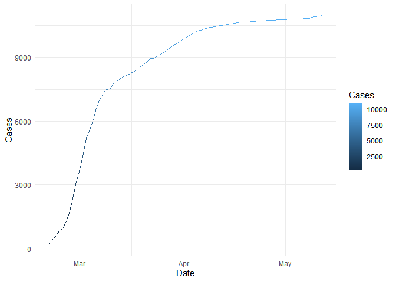<!-- -->

### New cases through time.

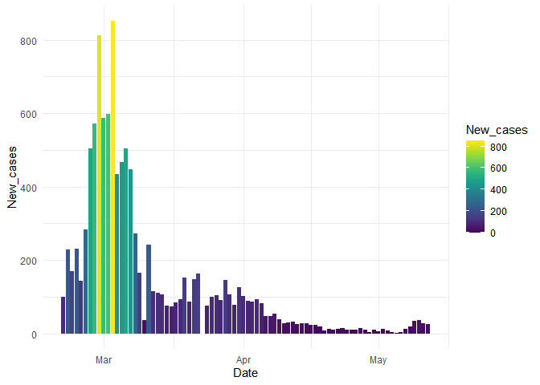<!-- -->

### The largest jump in new cases in a day.

| Date       | New cases |
| :--------- | --------: |
| 2020-03-03 |       851 |

### Daily deaths.

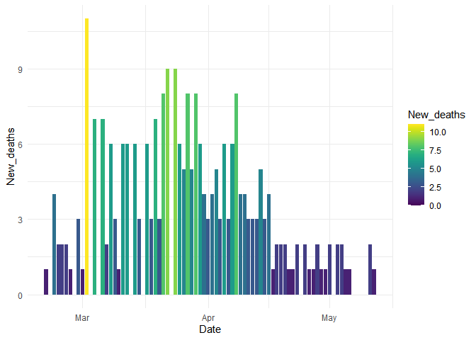<!-- -->

| Date       | New deaths |
| :--------- | ---------: |
| 2020-03-02 |         11 |

### Recoveries.

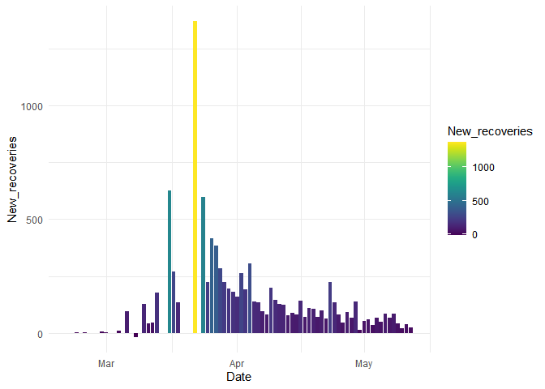<!-- -->

| Date       | New recoveries |
| :--------- | -------------: |
| 2020-03-22 |           1369 |

### Active vs Recovered cases.

<!-- -->

### R by day (the average number of people infected by a single infectious individual by day).

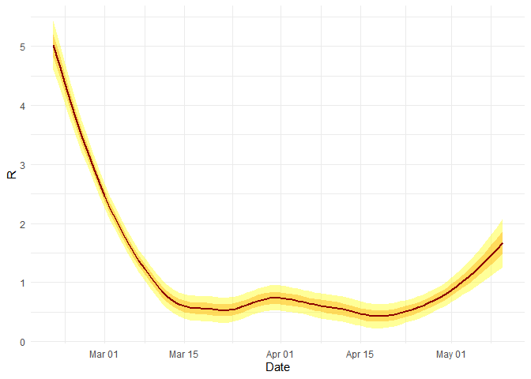<!-- -->

### R and days infectious.

Our dataset contains different R squared values depending on how long we
expect an average person to be able to transmit the virus. In reality,
days infectious may be even longer than that - according to Simas
Kucinskas’ research paper, the actual number may be closer to 23 days.

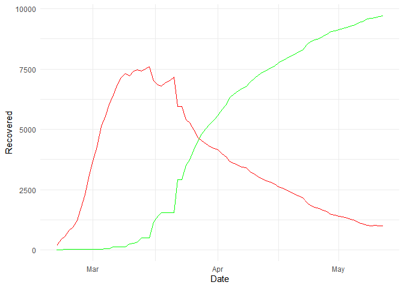<!-- -->

### Movement changes over time.

We can see a prominent increase in mobility in Parks, which corresponds
with our expectations of people being more likely to spend time in
nature during times of social distancing.

Residential mobility is also somewhat higher than the baseline, which
makes sense, given that more people should have started staying at home.

Grocery and Pharmacy experienced a drop initially, but later on started
exceeding the baseline mobility percentages, possibly because South
Korea was fairly effective at handling the covid crisis right from the
beginning, meaning that restrictions could be raised earlier than in
other countries.

<!-- -->

### Death rate over time.

The change in death rate is an interesting variable to look at. It could
reflect changes in the healthcare system’s ability to care for the
critically ill, or changes in testing.

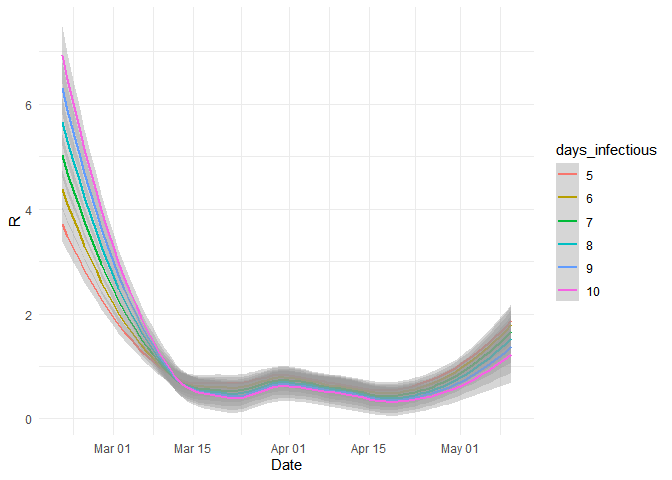<!-- -->

### 4\. & 5. Simple models which explain seperate mobility indicator changes with Covid-19 cases data.

<table style="border-collapse:collapse; border:none;">

<tr>

<th style="border-top: double; text-align:center; font-style:normal; font-weight:bold; padding:0.2cm;  text-align:left; ">

 

</th>

<th colspan="1" style="border-top: double; text-align:center; font-style:normal; font-weight:bold; padding:0.2cm; ">

Retail\_Recr

</th>

<th colspan="1" style="border-top: double; text-align:center; font-style:normal; font-weight:bold; padding:0.2cm; ">

Grocery\_Pharm

</th>

<th colspan="1" style="border-top: double; text-align:center; font-style:normal; font-weight:bold; padding:0.2cm; ">

Parks

</th>

<th colspan="1" style="border-top: double; text-align:center; font-style:normal; font-weight:bold; padding:0.2cm; ">

Transit

</th>

<th colspan="1" style="border-top: double; text-align:center; font-style:normal; font-weight:bold; padding:0.2cm; ">

Workplaces

</th>

<th colspan="1" style="border-top: double; text-align:center; font-style:normal; font-weight:bold; padding:0.2cm; ">

Residential

</th>

</tr>

<tr>

<td style=" text-align:center; border-bottom:1px solid; font-style:italic; font-weight:normal;  text-align:left; ">

Predictors

</td>

<td style=" text-align:center; border-bottom:1px solid; font-style:italic; font-weight:normal;  ">

Estimates

</td>

<td style=" text-align:center; border-bottom:1px solid; font-style:italic; font-weight:normal;  ">

Estimates

</td>

<td style=" text-align:center; border-bottom:1px solid; font-style:italic; font-weight:normal;  ">

Estimates

</td>

<td style=" text-align:center; border-bottom:1px solid; font-style:italic; font-weight:normal;  ">

Estimates

</td>

<td style=" text-align:center; border-bottom:1px solid; font-style:italic; font-weight:normal;  ">

Estimates

</td>

<td style=" text-align:center; border-bottom:1px solid; font-style:italic; font-weight:normal;  col7">

Estimates

</td>

</tr>

<tr>

<td style=" padding:0.2cm; text-align:left; vertical-align:top; text-align:left; ">

(Intercept)

</td>

<td style=" padding:0.2cm; text-align:left; vertical-align:top; text-align:center;  ">

\-28.78 \*\*\*

</td>

<td style=" padding:0.2cm; text-align:left; vertical-align:top; text-align:center;  ">

\-8.47 \*\*\*

</td>

<td style=" padding:0.2cm; text-align:left; vertical-align:top; text-align:center;  ">

\-19.50 \*\*\*

</td>

<td style=" padding:0.2cm; text-align:left; vertical-align:top; text-align:center;  ">

\-23.14 \*\*\*

</td>

<td style=" padding:0.2cm; text-align:left; vertical-align:top; text-align:center;  ">

\-9.20 \*\*\*

</td>

<td style=" padding:0.2cm; text-align:left; vertical-align:top; text-align:center;  col7">

9.15 \*\*\*

</td>

</tr>

<tr>

<td style=" padding:0.2cm; text-align:left; vertical-align:top; text-align:left; ">

Cases

</td>

<td style=" padding:0.2cm; text-align:left; vertical-align:top; text-align:center;  ">

\-0.00 

</td>

<td style=" padding:0.2cm; text-align:left; vertical-align:top; text-align:center;  ">

\-0.00 

</td>

<td style=" padding:0.2cm; text-align:left; vertical-align:top; text-align:center;  ">

0.00 \*\*

</td>

<td style=" padding:0.2cm; text-align:left; vertical-align:top; text-align:center;  ">

\-0.00 \*\*

</td>

<td style=" padding:0.2cm; text-align:left; vertical-align:top; text-align:center;  ">

0.00 

</td>

<td style=" padding:0.2cm; text-align:left; vertical-align:top; text-align:center;  col7">

0.00 

</td>

</tr>

<tr>

<td style=" padding:0.2cm; text-align:left; vertical-align:top; text-align:left; ">

Deaths

</td>

<td style=" padding:0.2cm; text-align:left; vertical-align:top; text-align:center;  ">

0.10 \*\*\*

</td>

<td style=" padding:0.2cm; text-align:left; vertical-align:top; text-align:center;  ">

0.09 \*\*\*

</td>

<td style=" padding:0.2cm; text-align:left; vertical-align:top; text-align:center;  ">

0.15 \*\*\*

</td>

<td style=" padding:0.2cm; text-align:left; vertical-align:top; text-align:center;  ">

0.08 \*\*\*

</td>

<td style=" padding:0.2cm; text-align:left; vertical-align:top; text-align:center;  ">

\-0.03 \*

</td>

<td style=" padding:0.2cm; text-align:left; vertical-align:top; text-align:center;  col7">

\-0.02 \*\*\*

</td>

</tr>

<tr>

<td style=" padding:0.2cm; text-align:left; vertical-align:top; text-align:left; padding-top:0.1cm; padding-bottom:0.1cm; border-top:1px solid;">

Observations

</td>

<td style=" padding:0.2cm; text-align:left; vertical-align:top; padding-top:0.1cm; padding-bottom:0.1cm; text-align:left; border-top:1px solid;" colspan="1">

444

</td>

<td style=" padding:0.2cm; text-align:left; vertical-align:top; padding-top:0.1cm; padding-bottom:0.1cm; text-align:left; border-top:1px solid;" colspan="1">

444

</td>

<td style=" padding:0.2cm; text-align:left; vertical-align:top; padding-top:0.1cm; padding-bottom:0.1cm; text-align:left; border-top:1px solid;" colspan="1">

444

</td>

<td style=" padding:0.2cm; text-align:left; vertical-align:top; padding-top:0.1cm; padding-bottom:0.1cm; text-align:left; border-top:1px solid;" colspan="1">

444

</td>

<td style=" padding:0.2cm; text-align:left; vertical-align:top; padding-top:0.1cm; padding-bottom:0.1cm; text-align:left; border-top:1px solid;" colspan="1">

444

</td>

<td style=" padding:0.2cm; text-align:left; vertical-align:top; padding-top:0.1cm; padding-bottom:0.1cm; text-align:left; border-top:1px solid;" colspan="1">

444

</td>

</tr>

<tr>

<td style=" padding:0.2cm; text-align:left; vertical-align:top; text-align:left; padding-top:0.1cm; padding-bottom:0.1cm;">

R2 / R2 adjusted

</td>

<td style=" padding:0.2cm; text-align:left; vertical-align:top; padding-top:0.1cm; padding-bottom:0.1cm; text-align:left;" colspan="1">

0.596 / 0.594

</td>

<td style=" padding:0.2cm; text-align:left; vertical-align:top; padding-top:0.1cm; padding-bottom:0.1cm; text-align:left;" colspan="1">

0.449 / 0.447

</td>

<td style=" padding:0.2cm; text-align:left; vertical-align:top; padding-top:0.1cm; padding-bottom:0.1cm; text-align:left;" colspan="1">

0.348 / 0.345

</td>

<td style=" padding:0.2cm; text-align:left; vertical-align:top; padding-top:0.1cm; padding-bottom:0.1cm; text-align:left;" colspan="1">

0.574 / 0.572

</td>

<td style=" padding:0.2cm; text-align:left; vertical-align:top; padding-top:0.1cm; padding-bottom:0.1cm; text-align:left;" colspan="1">

0.018 / 0.013

</td>

<td style=" padding:0.2cm; text-align:left; vertical-align:top; padding-top:0.1cm; padding-bottom:0.1cm; text-align:left;" colspan="1">

0.264 / 0.261

</td>

</tr>

<tr>

<td colspan="7" style="font-style:italic; border-top:double black; text-align:right;">

  - p\<0.05   \*\* p\<0.01   \*\*\* p\<0.001
    </td>
    </tr>

</table>

The Covid-19 data explain different mobility indicators differently. Not
for all of the indicators the Cases variable is significant (note the
lack of stars). They have different R-squareds, meaning that
Retail\_Recr and Transit both have the highest (around 0.6) which
indicates that their fit is quite ok. But for example Workplaces have an
incredibly low R-squared (0.02) which means that the fit is not
accurate.

### 6\. We used the models for forecasting. The forecasts were …

|   Grocery\_Pharm | Grocery\_Pharm\_pr |    Parks |  Parks\_pr |    Residential | Residential\_pr | Retail\_Recr | Retail\_Recr\_pr | Transit | Transit\_pr | Workplaces | Workplaces\_pr |
| ---------------: | -----------------: | -------: | ---------: | -------------: | --------------: | -----------: | ---------------: | ------: | ----------: | ---------: | -------------: |
|               23 |           9.811291 |      114 |   48.95736 |             14 |        5.129596 |           13 |       \-7.779660 |    \-14 |  \-7.770808 |       \-56 |     \-10.78662 |
|               23 |           9.811291 |      114 |   48.95736 |             14 |        5.129596 |           13 |       \-7.779660 |    \-14 |  \-7.770808 |       \-56 |     \-10.78662 |
|               23 |           9.811291 |      114 |   48.95736 |             14 |        5.129596 |           13 |       \-7.779660 |    \-14 |  \-7.770808 |       \-56 |     \-10.78662 |
|               23 |           9.811291 |      114 |   48.95736 |             14 |        5.129596 |           13 |       \-7.779660 |    \-14 |  \-7.770808 |       \-56 |     \-10.78662 |
|               23 |           9.811291 |      114 |   48.95736 |             14 |        5.129596 |           13 |       \-7.779660 |    \-14 |  \-7.770808 |       \-56 |     \-10.78662 |
|               23 |           9.811291 |      114 |   48.95736 |             14 |        5.129596 |           13 |       \-7.779660 |    \-14 |  \-7.770808 |       \-56 |     \-10.78662 |
|                9 |           9.895114 |       48 |   49.11842 |              3 |        5.109794 |         \-10 |       \-7.682633 |     \-4 |  \-7.690474 |        \-1 |     \-10.81089 |
|                9 |           9.895114 |       48 |   49.11842 |              3 |        5.109794 |         \-10 |       \-7.682633 |     \-4 |  \-7.690474 |        \-1 |     \-10.81089 |
|                9 |           9.895114 |       48 |   49.11842 |              3 |        5.109794 |         \-10 |       \-7.682633 |     \-4 |  \-7.690474 |        \-1 |     \-10.81089 |
|                9 |           9.895114 |       48 |   49.11842 |              3 |        5.109794 |         \-10 |       \-7.682633 |     \-4 |  \-7.690474 |        \-1 |     \-10.81089 |
|                9 |           9.895114 |       48 |   49.11842 |              3 |        5.109794 |         \-10 |       \-7.682633 |     \-4 |  \-7.690474 |        \-1 |     \-10.81089 |
|                9 |           9.895114 |       48 |   49.11842 |              3 |        5.109794 |         \-10 |       \-7.682633 |     \-4 |  \-7.690474 |        \-1 |     \-10.81089 |
|                7 |           9.891318 |       36 |   49.15201 |              2 |        5.111053 |          \-7 |       \-7.687218 |     \-4 |  \-7.696744 |        \-1 |     \-10.80524 |
|                7 |           9.891318 |       36 |   49.15201 |              2 |        5.111053 |          \-7 |       \-7.687218 |     \-4 |  \-7.696744 |        \-1 |     \-10.80524 |
|                7 |           9.891318 |       36 |   49.15201 |              2 |        5.111053 |          \-7 |       \-7.687218 |     \-4 |  \-7.696744 |        \-1 |     \-10.80524 |
| The forecasts do | not appear to be e | xtremely | accurate f | or South Korea |               . |              |                  |         |             |            |                |

### 7\. For comparisons we picked a second country that was quite culturally and geographically similar - Japan.

### We combined all of the data in one data frame for Japan only. Rows contain the days and columns have such variables as number of deaths, death rate, confirmed cases, recovered cases, effective reproduction rate, mobility changes from the baseline in various environments and etc.

### We did exploratory analysis of the data on different levels:

### 

### Case growth over time.

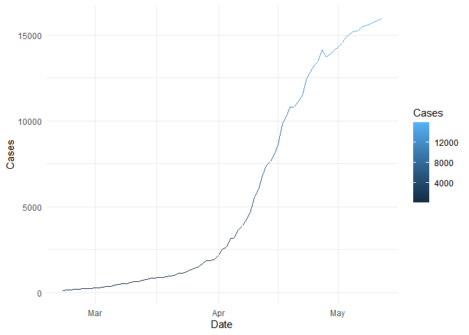<!-- -->

### New cases through time.

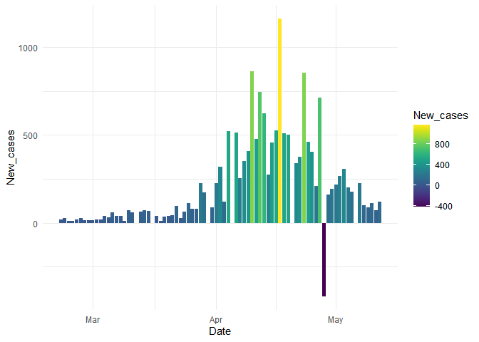<!-- -->

### The largest jump in new cases in a day.

| Date       | New cases |
| :--------- | --------: |
| 2020-04-17 |      1161 |

### Daily deaths.

<!-- -->

### Biggest jump in deaths in a single day

| Date       | New deaths |
| :--------- | ---------: |
| 2020-05-04 |         49 |

### Recoveries.

Japan started recovering later than South Korea.

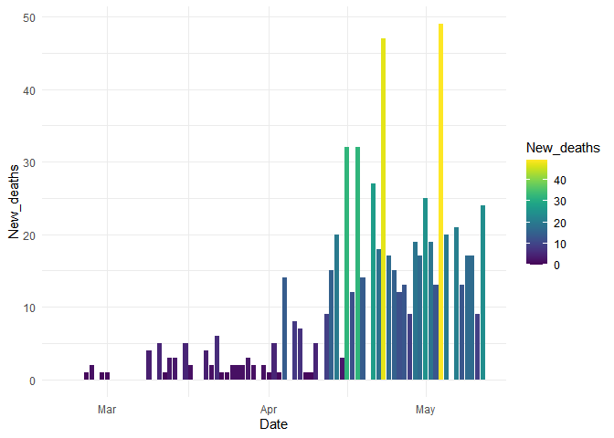<!-- -->

### Biggest jump in recoveries in a single day

| Date       | New recoveries |
| :--------- | -------------: |
| 2020-05-10 |           2221 |

### Active vs Recovered cases.

We can see that recovered cases only surpassed active cases in May,
unlike in South Korea, where that happened even prior to April.

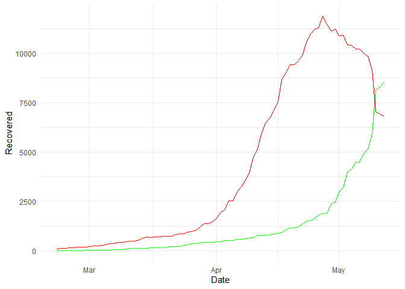<!-- -->

### R by day (the average number of people infected by a single infectious individual by day).

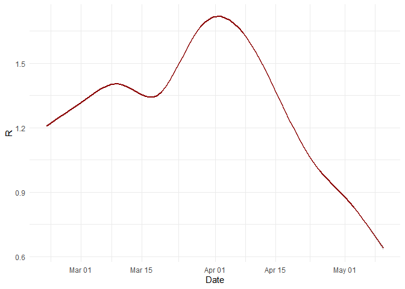<!-- -->

### R and days infectious.

<!-- -->

### Movement changes over time.

Here we also see an increase in the movement in Parks and Residential
complexes.

Interest in Grocery and Pharmacy stores has still been declining, which
is probably related to the fact that Japan started getting hold of the
situation later than South Korea did.

<!-- -->

### Death rate over time.

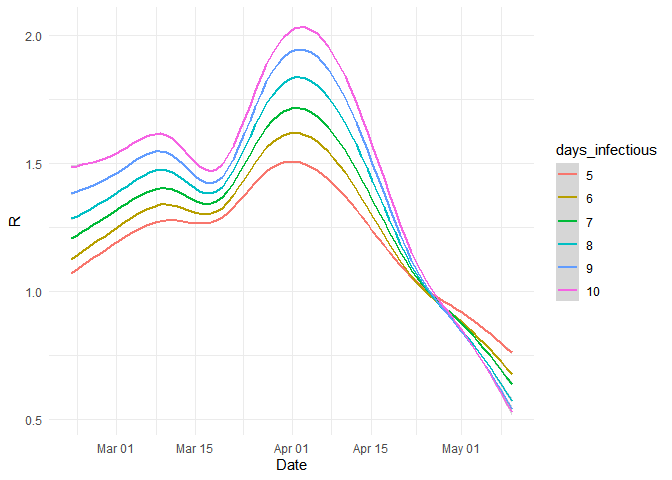<!-- -->

### Simple models which explain seperate mobility indicator changes with Covid-19 cases data.

    ## 
    ## ============================================================================================================
    ##                                                             Dependent variable:                             
    ##                                -----------------------------------------------------------------------------
    ##                                Retail_Recr Grocery_Pharm   Parks       Transit     Workplaces   Residential 
    ##                                    (1)          (2)         (3)          (4)           (5)          (6)     
    ## ------------------------------------------------------------------------------------------------------------
    ## Cases                           -0.022***    0.016***    -0.047***    0.078***      0.225***     -0.070***  
    ##                                  (0.003)      (0.002)     (0.008)      (0.003)       (0.002)      (0.001)   
    ##                                                                                                             
    ## Deaths                                                                                                      
    ##                                                                                                             
    ##                                                                                                             
    ## Constant                       314.700***   -241.849***  727.617*** -1,257.190*** -3,494.632*** 1,102.460***
    ##                                 (52.571)     (29.055)    (124.389)    (41.807)      (26.680)      (16.547)  
    ##                                                                                                             
    ## ------------------------------------------------------------------------------------------------------------
    ## Observations                       864          864         864          864           864          864     
    ## R2                                0.045        0.073       0.037        0.490         0.951        0.832    
    ## Adjusted R2                       0.044        0.072       0.036        0.489         0.951        0.832    
    ## Residual Std. Error (df = 862)   10.645        5.883       25.188       8.466         5.403        3.351    
    ## F Statistic (df = 1; 862)       40.784***    67.949***   33.167***   828.273***   16,637.900*** 4,264.770***
    ## ============================================================================================================
    ## Note:                                                                            *p<0.1; **p<0.05; ***p<0.01

The Covid-19 data explain different mobility indicators differently.
Contrary to South Korea models, for all of the indicators the Cases
variable is significant (note the 3 stars). Compared to South Korea, the
R squareds give very different results: for SK Retail\_Recr had a high
R-squared which indicated that the fit was quite ok, but for Japan this
R-squared is very low.

And, very interestingly, Workplaces for South Korea had an incredibly
low R-squared (0.02) which meant that the fit is bad, but for Japan the
R-squared here is very high meaning that the fit is good.

Also, in the case of Japan, the fit of Residential is very good.

### We used the models for forecasting. The forecasts were …

| Grocery\_Pharm | Grocery\_Pharm\_pr | Parks | Parks\_pr | Residential | Residential\_pr | Retail\_Recr | Retail\_Recr\_pr | Transit | Transit\_pr | Workplaces | Workplaces\_pr |
| -------------: | -----------------: | ----: | --------: | ----------: | --------------: | -----------: | ---------------: | ------: | ----------: | ---------: | -------------: |
|              0 |         \-3.520833 |    29 |  14.76042 |          29 |        27.14583 |         \-23 |       \-19.38542 |    \-65 |    \-59.875 |       \-73 |     \-70.08333 |
|              0 |         \-3.520833 |    29 |  14.76042 |          29 |        27.14583 |         \-23 |       \-19.38542 |    \-65 |    \-59.875 |       \-73 |     \-70.08333 |
|              0 |         \-3.520833 |    29 |  14.76042 |          29 |        27.14583 |         \-23 |       \-19.38542 |    \-65 |    \-59.875 |       \-73 |     \-70.08333 |
|              0 |         \-3.520833 |    29 |  14.76042 |          29 |        27.14583 |         \-23 |       \-19.38542 |    \-65 |    \-59.875 |       \-73 |     \-70.08333 |
|              0 |         \-3.520833 |    29 |  14.76042 |          29 |        27.14583 |         \-23 |       \-19.38542 |    \-65 |    \-59.875 |       \-73 |     \-70.08333 |
|              0 |         \-3.520833 |    29 |  14.76042 |          29 |        27.14583 |         \-23 |       \-19.38542 |    \-65 |    \-59.875 |       \-73 |     \-70.08333 |
|              1 |         \-3.520833 |    46 |  14.76042 |          30 |        27.14583 |         \-15 |       \-19.38542 |    \-68 |    \-59.875 |       \-76 |     \-70.08333 |
|              1 |         \-3.520833 |    46 |  14.76042 |          30 |        27.14583 |         \-15 |       \-19.38542 |    \-68 |    \-59.875 |       \-76 |     \-70.08333 |
|              1 |         \-3.520833 |    46 |  14.76042 |          30 |        27.14583 |         \-15 |       \-19.38542 |    \-68 |    \-59.875 |       \-76 |     \-70.08333 |
|              1 |         \-3.520833 |    46 |  14.76042 |          30 |        27.14583 |         \-15 |       \-19.38542 |    \-68 |    \-59.875 |       \-76 |     \-70.08333 |
|              1 |         \-3.520833 |    46 |  14.76042 |          30 |        27.14583 |         \-15 |       \-19.38542 |    \-68 |    \-59.875 |       \-76 |     \-70.08333 |
|              1 |         \-3.520833 |    46 |  14.76042 |          30 |        27.14583 |         \-15 |       \-19.38542 |    \-68 |    \-59.875 |       \-76 |     \-70.08333 |
|              6 |         \-3.520833 |    88 |  14.76042 |          23 |        27.14583 |            4 |       \-19.38542 |    \-45 |    \-59.875 |       \-70 |     \-70.08333 |
|              6 |         \-3.520833 |    88 |  14.76042 |          23 |        27.14583 |            4 |       \-19.38542 |    \-45 |    \-59.875 |       \-70 |     \-70.08333 |
|              6 |         \-3.520833 |    88 |  14.76042 |          23 |        27.14583 |            4 |       \-19.38542 |    \-45 |    \-59.875 |       \-70 |     \-70.08333 |

Our forecast appears to have worked significantly better for Japan than
it did for South Korea.

### In general when we compare our South Korea and Japan results, we can see that:

  - Japan overall has more cases but the growth was slower and more
    controlled at the beggining unlike in South Korea.
  - More people died at the beggining in South Korea where in Japan the
    majority of deaths accured in later periods. Similar trend is for
    recoveries.
  - The R trend is almost completely inverted between these two
    countries: in South Korea it’s U shaped (it was going downward ar
    first and then started to go up) but in Japan it’s inverted (was
    going up at first and then started rapidly going down).
  - Movement changes over time in Japan have more significant longer
    term slopes where in South Korea over time they stay almost in the
    same lane.
  - The death rate in South Korea seems to keep going up since March,
    but in Japan it had a dent (was downward sloping) in the middle of
    April.

### Some factors that could explain these differences:

  - Japan has more people than South Korea (\~2.45 times more): 126.5
    mil vs 51.6 mil
  - Japan was doing way less testing, meaning that there might be a lot
    of hidden cases. Also some people speculate that the government
    might be covering up the true numbers as they have a history of
    doing so.
  - Japanese people prior to the virus were openly using masks in public
    which could have lowered the chances of a sudden increase in cases.
  - Japan has a different greeting etiquete - a bow instead of a
    handshake or a kiss on the cheek
  - In Japan basic hygiene education is taught from an early age.
  - South Korea seemed to go after big clusters of virus outbreaks: they
    quickly tracked a specific church outbreak with a combination of
    interviews and cellphone surveillance to track down the recent
    contacts of new patients and ordered those contacts to self-isolate
    as well.
  - South Korea had a large amount of tests done very quickly.
  - South Korea was using expansive High-Tech Tracing.
  - South Korea was doing Zero-Tolerance Isolation
  - South Korea had a bad virus outbreak many years ago from which they
    learned a lot so it might have been easier for them to quickly
    control this one.
